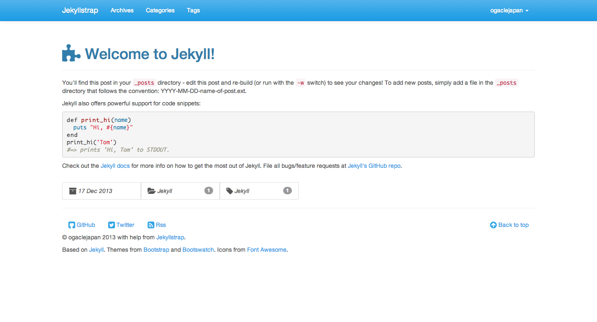

DEPRECATED
============

Jekyllstrap is deprecated.

See [materi for jekyll](http://github.com/ogaclejapan/materi-for-jekyll)

# Jekyllstrap

Jekyllstrap is a Jekyll template to which is applied a theme of Bootstrap.

* Based on [Jekyll][jekyll]
* Themes from [Bootstrap][bootstrap] and [Bootswatch][bootswatch].
* Icons from [Font Awesome][font-awesome].

[Preview][jekyllstrap-preview]



---

## Getting Started

Setup for a new Static site.

1. [Install Jekyll][jekyll-install]
2. Fork the [Jekyllstrap][jekyllstrap-github]
3. Clone the repo you just forked to your computer.
4. Edit `_config.yml` to personalize your site.
5. [Writing posts][jekyll-post] and [Build][jekyll-build].
6. Deploying your site to [GitHub Pages][jekyll-deploy] or [Amazon S3][jekyll-s3], etc...


```yaml
# _config.yml

name: Jekyllstrap                 # Change your site name, url, etc.
url: http://ogaclejapan.github.io
baseurl: /jekyllstrap
timezone: Asia/Tokyo
encoding: utf-8

markdown: redcarpet
redcarpet:
  extensions: ["strikethrough", "tables", "fenced_code_blocks"]

pygments: true
permalink: pretty
paginate: 10

owner :                           # Change your name, GitHub name, Twitter id.
  name : ogaclejapan
  github : ogaclejapan
  twitter : ogaclejapan
#  googleplus :
#  facebook :

# See http://schema.org/Article
schema_article_type : Article

#google_analytics :               # Available soon as you get the tracking code.
#  tracking_id : 'UA-XXXXXXXX-X'  # http://www.google.com/analytics/


#addthis:                         # Available soon as you get the pub code.
#  pub_id: 'ra-XXXXXXXXXXXXXXX'   # http://www.addthis.com/

exclude: ["README.md", "LICENSE", ".gitignore"]
```

---

## Customization

### Change the Bootstrap Theme

Edit `_includes/css.html` URLs.

```html
<link rel="stylesheet" href="//netdna.bootstrapcdn.com/bootswatch/3.0.3/cerulean/bootstrap.min.css">
<link rel="stylesheet" href="//netdna.bootstrapcdn.com/font-awesome/4.0.3/css/font-awesome.min.css">
<link rel="stylesheet" href="{{ site.baseurl }}/assets/css/all.min.css">
```

#### e.g. Other theme of [Bootswatch][bootswatch]. (using [Cosmo Theme][bootswatch-cosmo])

```html
<link rel="stylesheet" href="//netdna.bootstrapcdn.com/bootswatch/3.0.3/cosmo/bootstrap.min.css">
<!--
<link rel="stylesheet" href="//netdna.bootstrapcdn.com/bootswatch/3.0.3/cerulean/bootstrap.min.css">
-->
```

#### e.g. Plain [Bootstrap][bootstrap].

```html
<link rel="stylesheet" href="//netdna.bootstrapcdn.com/bootstrap/3.0.3/css/bootstrap.min.css">
<!--
<link rel="stylesheet" href="//netdna.bootstrapcdn.com/bootswatch/3.0.3/cerulean/bootstrap.min.css">
-->
```

---

## License

MIT License. See [LICENSE][jekyllstrap-license]

[jekyll]: http://jekyllrb.com/
[jekyll-install]: http://jekyllrb.com/docs/installation/
[jekyll-post]: http://jekyllrb.com/docs/posts/
[jekyll-build]: http://jekyllrb.com/docs/usage/
[jekyll-deploy]: http://jekyllrb.com/docs/github-pages/
[jekyll-s3]: https://github.com/laurilehmijoki/jekyll-s3
[bootstrap]: http://getbootstrap.com/
[bootswatch]: http://bootswatch.com/
[bootswatch-cosmo]: http://bootswatch.com/cosmo/
[font-awesome]: http://fontawesome.io/
[jekyllstrap-github]: https://github.com/ogaclejapan/jekyllstrap
[jekyllstrap-preview]: http://ogaclejapan.github.io/jekyllstrap/
[jekyllstrap-license]: https://github.com/ogaclejapan/jekyllstrap/blob/master/LICENSE
